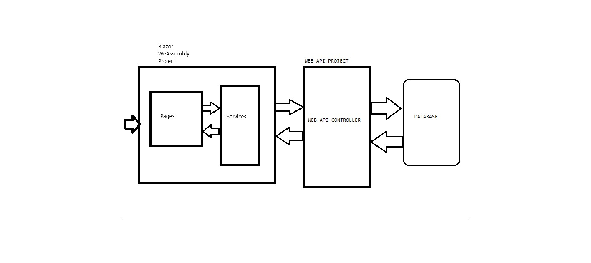

# KensShopOnlineSolution
# A practical approach to consuming a RESTFul Web service using Blazor WebAssembly
 img src="KenShopOnlineImages\Product List.jpg"
# Description

In this project I built a  shopping cart application using blazor webassembly.

## Table of Contents
* [General Info](#general-info)
* [Technologies Used](#technologies-used)
* [Setup](#setup)
    - [Create project](#create-project)
      -[Web API](#web-api)
      -[Blazor WebAssembly](#blazor-webassembly)
    - 
* [Usage](#usage)
* [Project Status](#project-status)
* [Room for Improvement](#room-for-improvement)
* [Acknowledgements](#acknowledgements)
* [Contact](#contact)                                                                                               
 <!--* [Screenshots](#screenshots)-->                                           
 <!--* [Features](#features)-->
  <!-- * [License](#license) -->
  
  The live versions of the project are below.
> Live demo [KensShopOnLineApi](https://www.example.com). <!-- If you have the project hosted somewhere, include the link here. -->
> Live demo [KensShopOnlineWeb](https://www.example.com). <!-- If you have the project hosted somewhere, include the link here. -->
> GitHubRepo [https://github.com/okalangkenneth/KensShopOnlineSolution)

## General Information
RESTful APIs are used to provide data from a server to a client application. They are based on HTTP and JSON and are designed to allow clients to access resources on servers without requiring prior knowledge about the structure of those resources. This is achieved through the use of Uniform Resource Identifiers (URIs) that uniquely identify resources on the server. These URIs can be thought of as “address” of the resource.

RESTful APIs have become increasingly popular over the last few years. There are many reasons why they are becoming more common. One reason is that they are easy to consume as they are built using HTTP and JSON and with frameworks such as ASP NET Core. In addition RESTful APIs are scalable and are stateless. This means that each request does not require any previous state to be maintained.

Blazor WebAssembly supports the consumption of RESTful APIs directly. This means that the API can easily interact with the web service using the HttpClient class.

<!-- ## Features
Our APIs is consumed using the C# programming language that supports HTTP requests.
RESTful API allows developers to create applications and web services by focusing solely on the interaction with clients rather than details regarding implementation.Web browsers need to send HTTP requests to servers via URLs through HTTP method verbs(GET /POST/PUT etc).A request sent via GET verb retrieves files from a server while PUT or POST sends updates to the server depending on whether we want to add new records or update existing ones respectively.-->

## Technologies Used
- Visual Studio - 2022
- .NET 6 
- SQL Server 2019
- Blazor WebAssembly
- Bootstrap 5
- RESTful Web API

## Setup
<!--Project requirements/dependencies list. A requirements.txt or a Pipfile.lock file perhaps and its location.

How to install / setup one's local environment / get started with the project.-->
### Create project

In Visual Studio 2022 we first create two projects, data flow is as indicated in the diagram. 

#### Web API
In the first project I will create various WEBAPIs according to my requirement,I created 4 APIs for my CRUD operations. I then add NuGet packages which contain all the necessary classes and interfaces that facilitate the creation of a Web API. Once the project has been created, the next step is to create the foundation of the API. This includes defining the services, middleware, endpoints, authentication, and routing.
Once the foundation has been created, I then defined the rules that enable the Blazor client to access the API. After that, I will host my on Heroku. 

Once the API project has been created, the final step was to generate the corresponding Blazor client code. This code will be used to access the Web API from the .Blazor application. To generate the code, I first need to create a new class that corresponds to the requested endpoint. The class needs to implement the IWebApi interface. This interface contains the necessary methods that enable the Blazor client to access the requested endpoint. Once the class has been created, I create a method that downloads the requested resource. This method needs a signature that contains the following three parameters:

- The URL of the requested endpoint.
- The type of the requested resource.
- The mandatory request body.

To test the API before its published I  used Swagger. This is done through HTTP requests that mimic the user cases. Below is a snap shot of Swaggere interface showing a request for all the products and  the response of 200 OK and in JSON format.

Below are the final project files in visual studio.

<!-- If you have screenshots you'd like to share, include them here. -->

## Usage

<!--In order to interact with data from the SQL server , we use RESTful API. The API project includes a swagger interface which has the products and shopping cart resources.  

Swagger helps in generating the API documentation for the code and makes it easier to share the API with others as well as keep track of changes to the API. It has futures like versioning, validation, authentication and caching.

To consume the API a second project, KensShopOnline.Web is built.

## Project Status
Project is: _in progress_.

## Room for Improvement

Room for improvement:
- Improvement to be done 1
- Improvement to be done 2

To do:
- Feature to be added 1
- Feature to be added 2

## Acknowledgements

- This project was inspired by [Farm Logs](https://farmlogs.com/). A farm management app, designed to help farmers execute their grain marketing decisions.
- This project was based on [this tutorial](https://www.udemy.com/course/aspnet-core-angular/).
- Many thanks to Mosh Hamedani

## Contact
Created by [Kenneth Okalang](https://okalangkenneth.com) - feel free to contact me!

<!-- Optional -->
<!-- ## License -->
<!-- This project is open source and available under the [... License](). -->

<!-- You don't have to include all sections - just the one's relevant to your project -->
